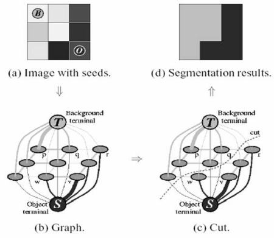

# Video Background Substitution

This repo demonstrates the background replacement with another video background. The process consists in extracting the background from  a video, then extract the moving objects from videos we want to substitute the background. The extracted background is combined with moving objects. Parameters (video files, background extraction algorithms, algo parameters)  are specified through the 'config.json' configuration file.

Videos should have non-moving backgrounds, meaning that the camera used to shoot the videos is fixed on the wall or somewhere else.

The program consists of the following steps:

    1. Background extraction.
    2. Foreground extraction 
    3. Replace the background.

# 1. Background subtraction.
## Median for Background Estimation
Background estimation can be regarded as a problem to construct the background from a series of video frames including moving objects in the scene. For a series of input video frames, we can randomly sample a few frames (nb_frames). Then, the median of the pixel over these frames will give a good estimate of the background at that pixel.
## Gaussian Mixture Models
Another way to do it, is ***Gaussian Mixture Models (GMM)***. Gaussian Mixture Models is the method of modelling data as a weighted sum of Gaussians. GMMs are widely used to cluster data, where each point in the n-dimensional feature space gets associated with each of the clusters with a certain probability, unlike in k-means clustering, where a point in the feature space gets associated with only a single cluster. Background modelling is the task of extracting the static background from a sequence of video frames. Once the background has been modelled, a technique called background subtraction which allows an image’s foreground to be extracted for further processing (object recognition etc.) is generally used. Hence, background modelling forms an integral part of foreground extraction and analysis.

Algorithm:
The step-wise approach is as follows:

    1.- Stack the frames in an array where the final array dimensions will be (num_frames, image_width, image_height, num_channels)
    2.- Initialize a dummy background image of the same size as that of the individual frames.
    3.- For each point characterized by the x-coordinate, the y-coordinate and the channel, model the intensity value across all the frames as a mixture of two Gaussians.
    4.- Once modelled, initialize the intensity value at the corresponding location in the dummy background image with the mean of the most weighted cluster. The most weighted           cluster will be the one coming from the background whereas owing to the dynamically changing and sparse nature of the foreground, the other cluster will be weighted less.
    5.- Finally, the background image will contain the intensity values corresponding to the static background.

     

## 2. Foreground extraction and substitution of background.
### Foreground extraction : Gaussian Mixture MOG - KNN
**MOG**: Gaussian Mixture-based Background/Foreground Segmentation Algorithm. It was introduced in the paper "An improved adaptive background mixture model for real-time tracking with shadow detection" by P. KadewTraKuPong and R. Bowden in 2001. It uses a method to model each background pixel by a mixture of K Gaussian distributions (K = 3 to 5). The weights of the mixture represent the time proportions that those colours stay in the scene. The probable background colours are the ones which stay longer and more static.

**K Nearest Neighbor**:
K-nearest neighbors (KNN) is a type of supervised learning algorithm used for both regression and classification. KNN tries to predict the correct class for the test data by calculating the distance between the test data and all the training points. Then select the K number of points which is closet to the test data. The KNN algorithm calculates the probability of the test data belonging to the classes of ‘K’ training data and class holds the highest probability will be selected.
The basics behind these algorithms how they work, you can get it from the below image:

------------------------------------------
### Foreground substitution : GrubCat 
GrabCut Algorithm: In this algorithm, the region is drawn in accordance with the foreground, a rectangle is drawn over it. This is the rectangle that encases main objects. The region coordinates are decided over understanding the foreground mask. But this segmentation is not perfect, as it may have marked some foreground region as background and vice versa. This problem can be avoided manually. This foreground extraction technique functions just like a green screen in cinematics. the main steps are:

    * The region of interest is decided by the amount of segmentation of foreground and background is to be performed and is chosen by the user. Everything outside the ROI is considered as background and turned black. The elements inside the ROI is still unknown.
    
    * Then Gaussian Mixture Model(GMM) is used for modeling the foreground and the background. Then, in accordance with the data provided by the user.
    
    * A graph is generated from this pixel distribution where the pixels are considered as nodes and two additional nodes are added that is the Source node and Sink node. All the foreground pixels are connected to the Source node and every Background pixel is connected to the Sink node. The weights of edges connecting pixels to the Source node and to the End node are defined by the probability of a pixel being in the foreground or in the background.
    
    * If huge dissimilarity is found in pixel color, the low weight is assigned to that edge. Then the algorithm is applied to segment the graph. The algorithm segments the graph into two, separating the source node and the sink node with the help of a cost function which is the sum of all weights of the edges that are segmented.
    
    * After the segmentation, the pixels that are connected to the Source node is labeled as foreground and those pixels which are connected to the Sink node is labeled as background. This process is done for multiple iterations as specified by the user. This gives us the extracted foreground.

The process is illustrated in below image:

GrabCut Scheme
:-------------------------:

### Foreground substitution : Pixellib and DeepLabv3+ pretrained model
DeepLab is a state-of-art deep learning model for semantic image segmentation, where the goal is to assign semantic labels (e.g., person, dog, cat and so on) to every pixel in the input image/video. We rely on the deeplabv3+ models trained on pascalvoc dataset for background substitution. 

We imported pixellib and from pixellib we imported in the class alter_bg. Instance of the class is created and and within the class we added a parameter model_type and set it to pb. we finally loaded the deeplabv3+ model. PixelLib supports two deeplabv3+ models, keras and tensorflow model. The keras model is extracted from the tensorflow model's checkpoint. The tensorflow model performs better than the keras model. We will make use of  [tensorflow model](https://github.com/ayoolaolafenwa/PixelLib/releases/download/1.1/xception_pascalvoc.pb)

The parameter detect (optional): this is the parameter that detects a particular object and filters out other detectons. It is set to detect person in the video.

## 3. Speed/Resource consumption.

Time/resource consumption is related to two points:

**Grubcat**
* The number of iterations of the GrabCat algorithm- default=1. This controlled by parameter "grubcut_iter" in the configuration file.
* The size of the rectagle. A large rectangle slowdowns of the algorithm. This controlled by parameter "grubcut_ROI" in the configuration file.

**DeepLabv3**
* frames_per_second: this is the parameter to set the number of frames per second for the output video file. 

## 4. Usage
### Local 
1. Make sure you have installed  all [required](https://github.com/HaithemH/videos_background_replacement/blob/master/requirements.txt) packages.
          run `pip install -r requirements.txt`.
3. Go to scripts directory.
4. Specify correct paths in [config](https://github.com/HaithemH/videos_background_replacement/blob/master/config.json) file.
5. To subtitute the background with **GrubCat** run: `python grubcutcombiner.py`.
6. To extract moving objects/forground run: `python mo_subtractor.py`.
### Colab
The colab notebook is [here](https://github.com/HaithemH/videos_background_substitution/blob/master/Video_Background_Substitution.ipynb)
### local Docker container:
     **Local container**:
    .- Clone the repo:  $git clone https://github.com/HaithemH/videos_background_substitution 
    .- Build image :    $sudo docker build -t bgeditor . 
    .- Run the image :  $sudo docker run -it bgeditor
    .- Run scripts :    Change video paths first.

     **Cloud container on Colab**:
     See the docker container section in the notebook.
### [Katacoda] Docker Playground:
    https://www.katacoda.com/courses/docker/playground#

## Running Environment to prepare the repo:
* Google Colab

### References:
https://medium.com/clustering-with-gaussian-mixture-model/clustering-with-gaussian-mixture-model-c695b6cd60da
https://docs.opencv.org/3.4.15/d1/dc5/tutorial_background_subtraction.html
https://www.geeksforgeeks.org/python-foreground-extraction-in-an-image-using-grabcut-algorithm/
https://github.com/VainF/DeepLabV3Plus-Pytorch
